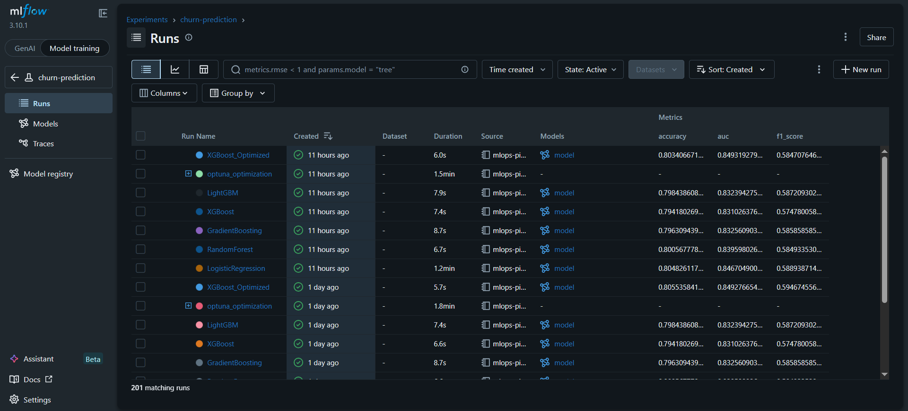
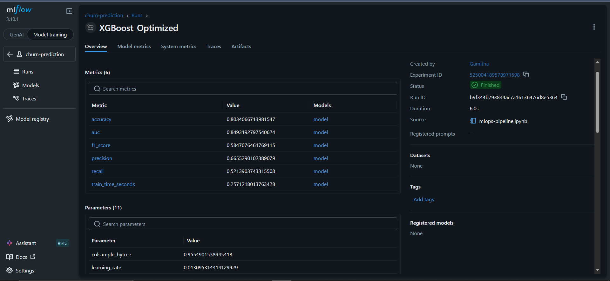

# 📊 MLOps Churn Pipeline

An end-to-end MLOps pipeline for predicting telecom customer churn, featuring experiment tracking with MLflow (201 runs), hyperparameter optimization with Optuna (50 trials), and a FastAPI REST endpoint for serving predictions.

> **💡 [View the Interactive Explanation →](https://htmlpreview.github.io/?https://github.com/GamithaManawadu/MLOps-Churn-Pipeline/blob/main/Explanations/mlops-pipeline-explained.html)**

<p align="center">
  
  
</p>

## What Is MLOps and Why It Matters

MLOps (Machine Learning Operations) is the set of practices that combines ML development with software engineering to deploy, track, and maintain ML models in production. Training a model is roughly 20% of the work in industry. The other 80% is tracking experiments, optimizing hyperparameters systematically, versioning models, and serving predictions through APIs. This project demonstrates the full lifecycle.

## Dataset

The Telco Customer Churn dataset from Kaggle contains 7,043 customers with 21 features covering demographics, services, contract type, and billing. The churn rate is 26.5%, making this an imbalanced classification problem. EDA revealed that customers who churn tend to have higher monthly charges and shorter tenure (newer customers leave faster). Three features were engineered: AvgChargesPerMonth, TenureBin (grouping tenure into 4 buckets), and HasMultipleServices.

## Pipeline Architecture

The preprocessing uses sklearn's ColumnTransformer to apply StandardScaler to numeric features and OneHotEncoder to categorical features. This transformer is bundled with the classifier into a single sklearn Pipeline, ensuring train and test data are always processed identically. The bundled pipeline is what gets saved and served, so the API doesn't need any separate preprocessing code. This eliminates the #1 production ML bug: train/test preprocessing mismatches.

## Experiment Tracking with MLflow

Every model training run is tracked in MLflow with its hyperparameters, evaluation metrics (accuracy, F1, AUC, precision, recall, training time), and the serialized model artifact. By the end of the notebook, 201 runs are logged and queryable through the MLflow dashboard at localhost:5000. This replaces the common approach of managing results across scattered notebooks with no way to compare or reproduce experiments.

## Baseline Models (5 Models Compared)

| Model               | Accuracy | F1 Score | AUC   |
| -------------------- | -------- | -------- | ----- |
| Logistic Regression  | 80.5%    | 0.5889   | 0.847 |
| LightGBM             | 79.8%    | 0.5872   | 0.832 |
| Gradient Boosting    | 79.6%    | 0.5859   | 0.833 |
| Random Forest        | 80.1%    | 0.5849   | 0.840 |
| XGBoost              | 79.4%    | 0.5748   | 0.831 |

Logistic Regression won the baseline comparison (F1=0.5889), demonstrating that simpler models can be competitive on well-preprocessed tabular data.

## Hyperparameter Optimization with Optuna

Optuna uses Bayesian optimization to search for the best XGBoost hyperparameters. Unlike grid search (which tries every combination) or random search (which guesses), Optuna learns from previous trials to focus on promising regions of the search space. Each of the 50 trials was logged to MLflow.

Optuna was applied to XGBoost rather than Logistic Regression as a deliberate engineering decision. Logistic Regression has only 2 tunable parameters (C and penalty) where a simple grid search suffices. XGBoost has 8+ interacting hyperparameters (n_estimators, max_depth, learning_rate, subsample, colsample_bytree, reg_alpha, reg_lambda, min_child_weight) where Bayesian optimization adds real value. The results validated this: baseline XGBoost (F1=0.5748) improved to F1=0.5947 after tuning, surpassing the LogReg baseline.

## Best Model: Optimized XGBoost

| Metric    | Value  |
| --------- | ------ |
| Accuracy  | 80.6%  |
| F1 Score  | 0.5947 |
| AUC       | 0.8493 |
| Precision | 66.6%  |
| Recall    | 53.7%  |

The best trial (#43 of 50) found that shallow trees (max_depth=3) with high regularization (reg_alpha=9.77) work best, preventing overfitting on this 7K-row dataset. The improvement over baseline XGBoost was +1.99% F1.

## FastAPI REST Endpoint

The saved model pipeline is served through a FastAPI endpoint that accepts customer data as JSON and returns a churn prediction with probability and risk level. The API auto-generates interactive Swagger documentation at /docs where anyone can test predictions without writing code.

Three test customer profiles demonstrate the model makes intuitive predictions. A new customer with high monthly charges on a month-to-month contract was predicted at 74.8% churn probability (High risk). A long-term customer with low charges on a 2-year contract was predicted at 2.9% (Low risk). A medium-tenure customer on a 1-year contract was predicted at 13.2% (Low risk).

## Running the Project

```bash
pip install -r requirements.txt
```

Run the notebook to train all models, optimize with Optuna, and generate api.py. Then start the API:

```bash
python -m uvicorn api:app --reload
```

Open http://localhost:8000/docs for the interactive Swagger UI. To view the MLflow dashboard:

```bash
mlflow ui
```

Open http://localhost:5000 to compare all experiments.

## Project Structure

```
MLOps-Churn-Pipeline/
├── mlops-pipeline.ipynb       # Main notebook
├── api.py                     # FastAPI endpoint (generated by notebook)
├── best_model.pkl             # Saved pipeline (generated by notebook)
├── feature_info.json          # Feature metadata (generated by notebook)
├── mlruns/                    # MLflow logs (generated by notebook)
├── Explanations/
│   └── mlops-pipeline-explained.html
├── requirements.txt
├── .gitignore
├── README.md
└── images/
    ├── mlflow_dashboard.png
    └── mlflow_run_detail.png
```

## Technologies

MLflow, Optuna, XGBoost, LightGBM, scikit-learn, FastAPI, Pandas, Matplotlib, Seaborn
